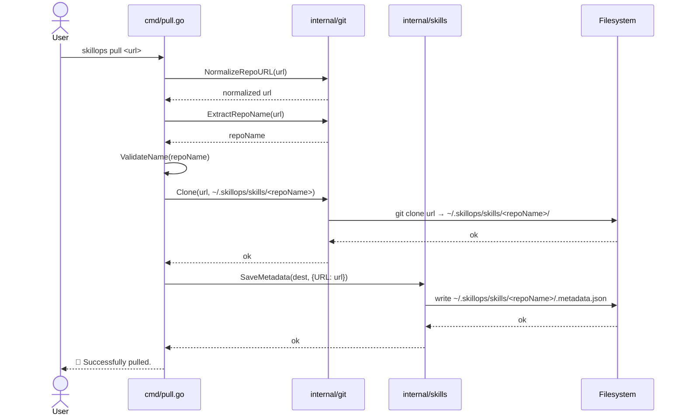
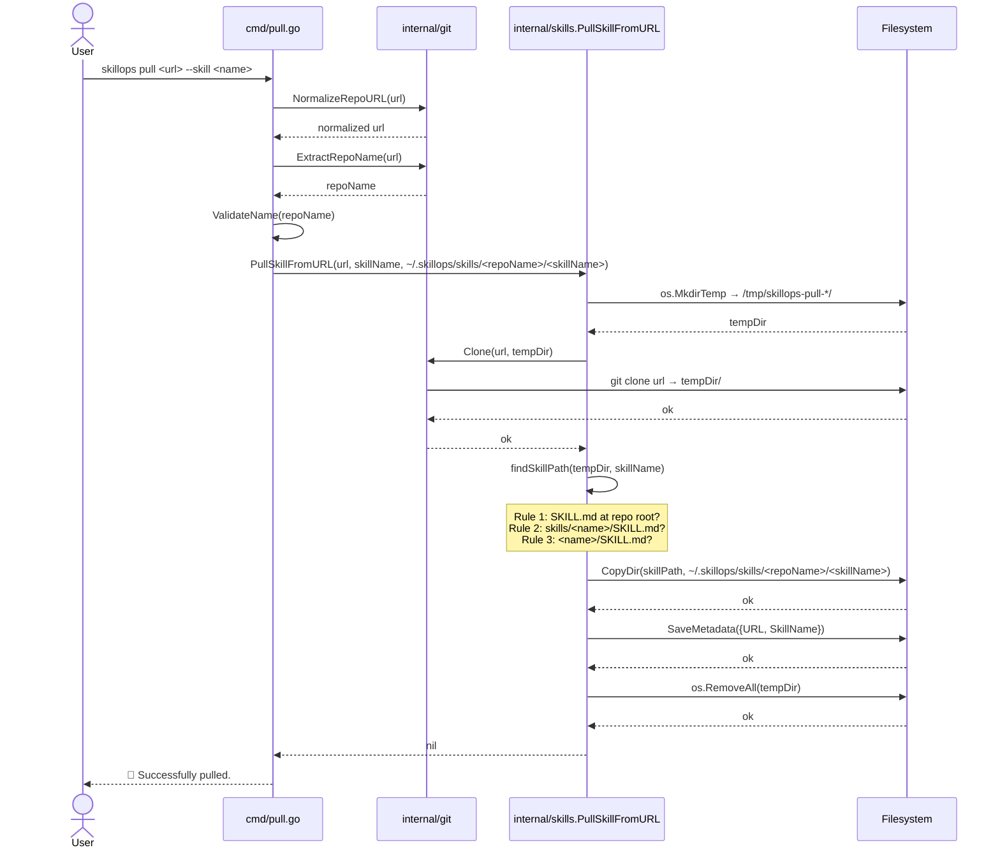

# skillops pull

Pull a skill repository (or a single skill) from GitHub into the global skill store.

- **Latest version**: v1.0.0
- **Group**: Skill commands

---

## Overview

`skillops pull` downloads skill repositories from GitHub into `~/.skillops/skills/`. It supports two modes:

| Mode | Command | When to use |
|---|---|---|
| Full repo | `skillops pull <url>` | Pull an entire skill repository |
| Single skill | `skillops pull <url> --skill <name>` | Pull one specific skill from a repo |

In full-repo mode the entire repository is cloned directly. In single-skill mode the repository is cloned to a temporary directory, the target skill is located using a 3-rule discovery strategy, and only that skill folder is copied to the global store — the temp clone is then deleted.

---

## Usage

```
skillops pull <repo_url> [flags]
```

**Flags**

| Flag | Shorthand | Description |
|---|---|---|
| `--skill <name>` | `-s` | Pull only the named skill from the repository |

---

## Sequence Diagrams

### Full repo pull (`skillops pull <url>`)



### Single skill pull (`skillops pull <url> --skill <name>`)



---

## Skill discovery rules (single-skill mode)

When `--skill <name>` is used, `findSkillPath` searches the cloned repo in this order:

| Priority | Rule | Condition |
|---|---|---|
| 1 | **Root skill** | `SKILL.md` exists at the repo root |
| 2 | **Container skill** | `skills/<name>/SKILL.md` exists |
| 3 | **Direct subfolder** | `<name>/SKILL.md` exists |

If none of the rules match, the command exits with an error.

---

## Samples

### Pull an entire repository

```bash
skillops pull https://github.com/org/my-skills-repo
# Result: ~/.skillops/skills/my-skills-repo/<all-skills>/
```

### Pull a single skill

```bash
skillops pull https://github.com/org/my-skills-repo --skill auth-agent
# Result: ~/.skillops/skills/my-skills-repo/auth-agent/
```

Using shorthand:

```bash
skillops pull https://github.com/org/my-skills-repo -s auth-agent
```

### Pull a skill that lives at the repo root

```bash
# Repo structure: org/single-skill-repo/SKILL.md
skillops pull https://github.com/org/single-skill-repo --skill single-skill-repo
# Result: ~/.skillops/skills/single-skill-repo/single-skill-repo/
```

---

## Global store layout after pull

```
~/.skillops/
  skills/
    my-skills-repo/
      .metadata.json        ← saved by SaveMetadata
      auth-agent/
        SKILL.md
        ...
      logging-agent/
        SKILL.md
        ...
```

---

## Notices

- **Duplicate repos**: If the destination directory already exists, `git.Clone` will fail. Delete `~/.skillops/skills/<repo-name>/` manually before re-pulling.
- **Name validation**: Repository names containing characters outside `[a-zA-Z0-9._-]` are rejected.
- **Temp dir cleanup**: Single-skill pulls always remove the temporary clone, even on failure (`defer os.RemoveAll`).
- **Metadata**: `SaveMetadata` failure is non-fatal — the skill is still pulled successfully with a warning printed to stderr.
- **Private repos**: Requires standard Git credentials (SSH key or HTTPS token) configured in the local environment.

---

## Related commands

| Command | Description |
|---|---|
| `skillops list` | List all skills in the global store |
| `skillops update` | Update a pulled repository to its latest commit |
| `skillops add` | Link a pulled skill into the current project |
| `skillops sync` | Restore all symlinks, auto-pulling missing skills if registries are configured |
