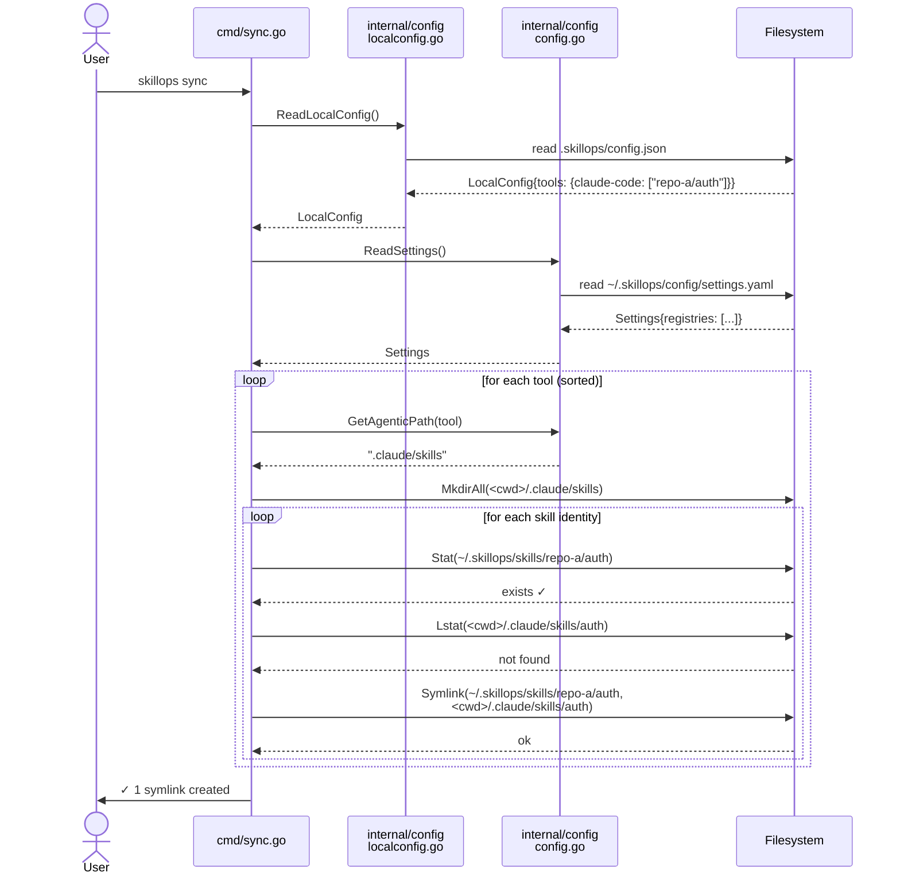
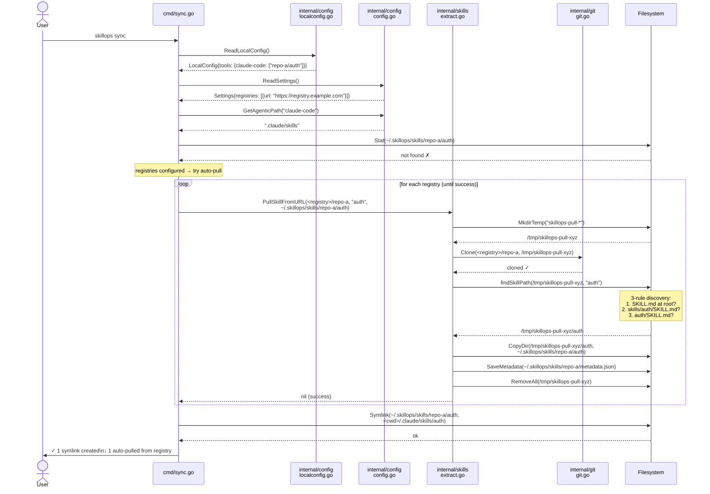

# skillops sync

> **Latest version**: v1.0.0  
> **Group**: project

## Overview

`skillops sync` restores all project symlinks declared in `.skillops/config.json`.  
It is the single command that reconciles the *desired state* (local config) with *actual state* (symlinks on disk).

Use it after:
- Cloning a repo that already has `.skillops/config.json`
- Upgrading from skillops v1
- Deleting symlinks manually (e.g. after `git clean`)
- Adding a new IDE to the config via `skillops add`

### Two sync modes

| Scenario | Behaviour |
|---|---|
| Skill already in global store | Creates symlink immediately (no network) |
| Skill missing, registries configured | Auto-pulls from registry then symlinks |
| Skill missing, no registries | Warns and skips; suggests `skillops pull` |

---

## Usage

```
skillops sync
```

No flags. Reads `.skillops/config.json` from the current working directory.

---

## Sequence Diagrams

### Standard sync (skill already in global store)



### Auto-pull sync (skill missing from global store)



---

## Skill identity format

Skills in `.skillops/config.json` are stored as `"repo/skill"`:

```json
{
  "version": "1",
  "tools": {
    "claude-code": ["shared-skills/auth-agent", "shared-skills/logger"],
    "cursor":      ["shared-skills/auth-agent"]
  }
}
```

`sync` derives:
- **repo name** → `shared-skills` (parent directory under `~/.skillops/skills/`)
- **symlink name** → `auth-agent` (filename in the IDE's skills directory)

---

## Samples

### Restore links after cloning a team repo

```sh
git clone https://github.com/org/project
cd project
skillops sync
# ✓ 4 symlinks created
```

### Restore links after upgrading from v1

```sh
skillops init   # re-declare which IDEs this project uses
skillops sync   # recreate the symlinks
```

### Auto-pull from a private registry

Ensure `~/.skillops/config/settings.yaml` has a registry entry:

```yaml
registries:
  - name: my-org
    url: https://github.com/my-org
```

Then run:

```sh
skillops sync
# ↓ 2 auto-pulled from registry
# ✓ 2 symlinks created
```

### Check warnings without acting

```sh
skillops sync
# ⚠  1 warning
#    • skill 'missing-repo/tool' not found in any configured registry
```

---

## Resulting directory layout

After a successful sync the project tree looks like:

```
<project>/
  .skillops/
    config.json          ← source of truth (committed to git)
  .claude/
    skills/
      auth-agent  →  ~/.skillops/skills/shared-skills/auth-agent   (symlink)
      logger      →  ~/.skillops/skills/shared-skills/logger        (symlink)
  .cursor/
    skills/
      auth-agent  →  ~/.skillops/skills/shared-skills/auth-agent   (symlink)

~/.skillops/
  skills/
    shared-skills/
      auth-agent/
        SKILL.md
        ...
      logger/
        SKILL.md
        ...
```

---

## Notices

- **Idempotent** — running `sync` multiple times is safe; existing symlinks are skipped (checked via `os.Lstat`).
- **Conflict detection** — if a symlink short name already exists from a different repo, a warning is emitted and the new link is not created (never silently overwrites).
- **Unknown tool** — if a tool name in the config is not found in `agentics.yaml`, it is skipped with a warning.
- **Auto-pull is best-effort** — if all registries fail for a skill, the skill is skipped and a warning is shown; successfully pulled skills are still linked.
- **Metadata non-fatal** — failure to write `metadata.json` during auto-pull emits a warning to stderr but does not abort the sync.
- **No local config** — when `.skillops/config.json` is absent, sync prints a migration hint and exits with code 1:
  ```
  No local config found.

  If you're upgrading from v1, run:
    skillops init   — declare which IDEs this project uses
    skillops sync   — restore your skill links
  ```
- **Private repos** — auto-pull relies on `git clone`; ensure SSH keys or HTTPS credentials are available in the environment.

---

## Related commands

| Command | Purpose |
|---|---|
| `skillops init` | Declare which IDEs the project uses and populate `.skillops/config.json` |
| `skillops add` | Add a skill to one or more IDEs and create its symlink immediately |
| `skillops remove` | Remove a skill's symlink and config entry |
| `skillops pull` | Fetch a skill repo into the global store without linking |
| `skillops status` | Show which skills are linked in the current project |
